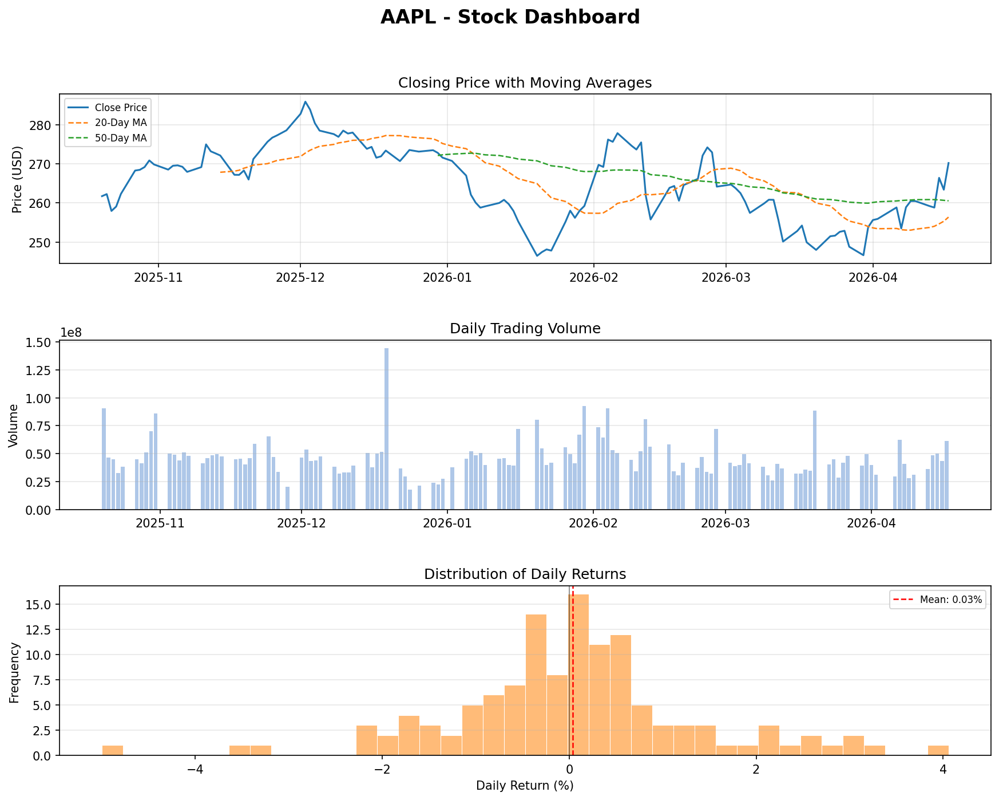

# Stock Market Dashboard
A Python dashboard that fetches real stock market data and visualises 
price trends, trading volume, and return distribution for any publicly 
traded stock.

Built with: Python, yfinance, pandas, matplotlib

## Dashboard Preview
