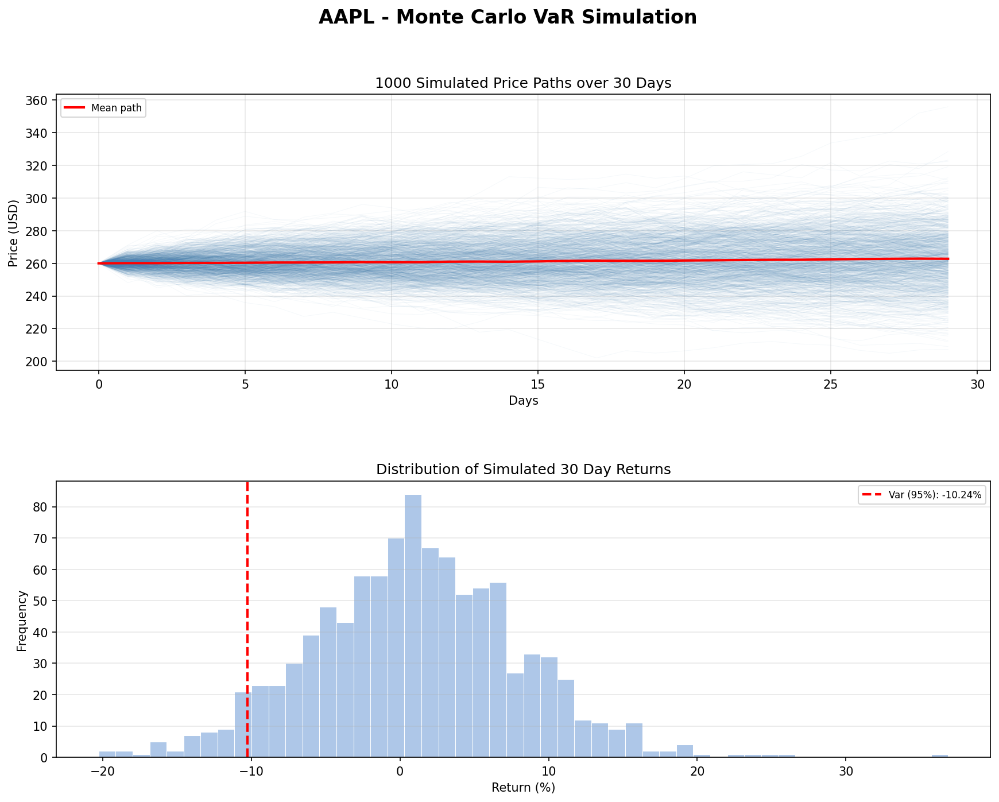

# Monte Carlo VaR Simulation

Simulates 1000 possible future price paths for a stock using Geometric 
Brownian Motion and calculates Value at Risk (VaR) at 95% confidence.

Built with: Python, NumPy, matplotlib

## Preview



## What it does

- Simulates 1000 price paths over 30 days using Geometric Brownian Motion
- Calculates 95% Value at Risk from the distribution of simulated returns
- Converts VaR into dollar terms for a given investment amount
- Visualises all price paths and the return distribution with VaR threshold

## Concepts covered

- Geometric Brownian Motion for realistic price simulation
- Value at Risk (VaR) and its interpretation
- Monte Carlo method for financial risk estimation
- Limitations of VaR and introduction to CVaR

## How to run

Install dependencies:
```bash
pip install numpy matplotlib
```

Run the simulation:
```bash
python monte_carlo.py
```

To change the stock or parameters, edit the constants at the top of the file:
```python
TICKER      = "TSLA"   # stock label
START_PRICE = 200.0    # current price
DRIFT       = 0.0004   # mean daily return
VOLATILITY  = 0.018    # std of daily returns
DAYS        = 30       # simulation horizon
SIMULATIONS = 1000     # number of paths
CONFIDENCE  = 0.95     # VaR confidence level
INVESTMENT  = 10000.0  # portfolio value
```

## Possible extensions

- Calculate CVaR (Expected Shortfall) for a more complete risk picture
- Pull live drift and volatility automatically from real stock data
- Add multiple assets for portfolio VaR
- Compare VaR across different confidence levels